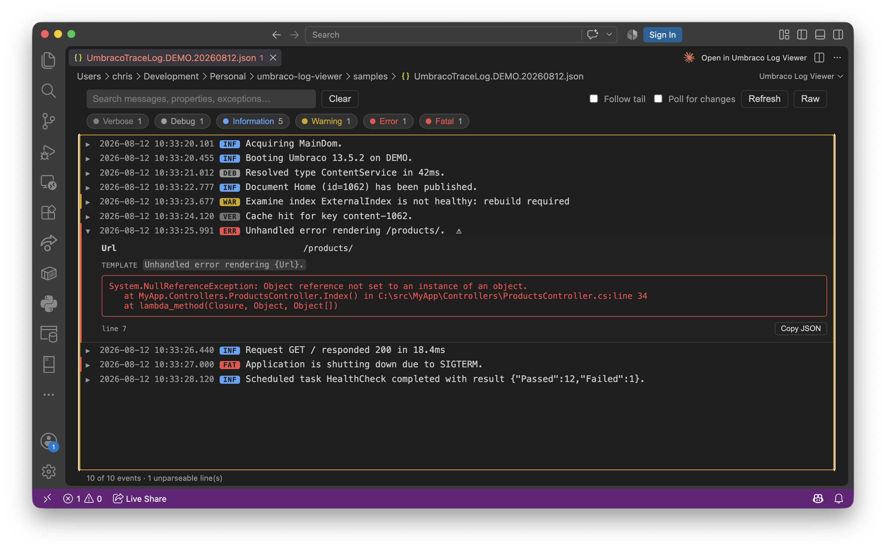

# Umbraco Log Viewer

A VS Code extension that turns `UmbracoTraceLog.*.json` files into a readable,
searchable log. Those files are **CLEF** (Compact Log Event Format) — one JSON
object per line, written by `Serilog.Formatting.Compact` — so a normal JSON
viewer can't parse them. This extension reads them line by line, renders each
Serilog message template with its properties filled in, and adds level
filtering, search, and expandable sections with the additional log item's information.

## Features

- Opens `UmbracoTraceLog*.json` and `*.clef` files automatically in the viewer
  (double-click, or right-click → **Open in Umbraco Log Viewer**).
- Log item line: `timestamp`, `level`, and `rendered message`, with additional structured data available in the dropdown.
- Colour-coded levels (Verbose → Fatal) with per-level counts and one-click
  filtering.
- Full-text search across rendered messages, properties, and exceptions.
- Expand any row to see structured properties, the original template, the
  exception stack trace, and the raw event (with **Copy JSON**).
- Live updates available as the file grows, plus an optional **Follow tail** mode.
- Skips unparseable lines gracefully and reports the count.

## How it maps CLEF fields

| CLEF field | Meaning              |
| ---------- | -------------------- |
| `@t`       | Timestamp            |
| `@l`       | Level (absent = Information) |
| `@mt`      | Message template     |
| `@m`       | Rendered message (used if present) |
| `@x`       | Exception            |
| `@i`       | Event id             |
| `@tr`/`@sp`| Trace / span id      |
| anything else | Structured property |

## Notes

- For very large files the list draws the most recent 3,000 matching events at a
  time; narrow with filters or search to see older ones.
- If you'd rather see the raw text, click **Raw** in the toolbar (or right-click
  the tab → **Reopen Editor With… → Text Editor**).

## Contributions

Contributions and comments are very welcome! Please feel free to open issues or pull requests. Developers can find more information at [ReadMeDevelopers.md](ReadMeDevelopers.md).

## License

MIT
